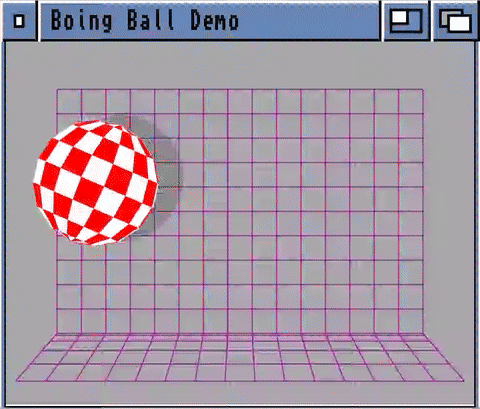

# Boing Ball Demo

## Yet Another Boing Ball Demo

Back in the days when real computers first emerged and users genuinely rejoiced in the joy of using them, a machine appeared that turned the computer market upside down. At the 1984 CES trade show, the Amiga 1000 was unveiled — and its now-iconic Boing Ball demo, stealing the spotlight, caused a worldwide jaw-drop. It took years for the industry to truly catch up.

This project features two core Jetpack Compose components: one responsible for rendering and animating the Boing Ball on a canvas (BoingBall.kt), and another dedicated solely to drawing the background (BoingBallBackground.kt).

*(For the Boing Ball component, I used some help from AI to handle the more complex parts of the 3D math.)*

> Amiga and Boing Ball are trademarks of Amiga Inc. (or whichever entity currently holds them)  
> The original Boing Ball demo was created by RJ Mical and Dale Luck.

## This is a Kotlin Multiplatform project targeting Android, iOS.

* [/androidApp](./androidApp)  contains the Android application entry point. Unlike `iosApp`, which requires Xcode
  to build and run, the Android app can be built, tested, and deployed entirely from Android Studio or the command
  line using Gradle tasks (e.g. `./gradlew :androidApp:installDebug`).

* [/iosApp](./iosApp/iosApp) contains an iOS application. Even if you’re sharing your UI with Compose Multiplatform,
  you need this entry point for your iOS app. This is also where you should add SwiftUI code for your project.

* [/shared](./shared/src) is for code that will be shared across your Compose Multiplatform applications.
  It contains several subfolders:
  - [commonMain](./shared/src/commonMain/kotlin) is for code that’s common for all targets.
  - [androidMain](./shared/src/androidMain/kotlin) and [iosMain](./shared/src/iosMain/kotlin) are for
    platform-specific Kotlin code. For example, `BoingBallAudioPlayer` uses `SoundPool` on Android and
    `AVAudioPlayer` on iOS, with a shared `expect` declaration in `commonMain`.
  - [commonTest](./shared/src/commonTest/kotlin) holds tests shared across all targets,
    while [androidHostTest](./shared/src/androidHostTest/kotlin) and
    [iosTest](./shared/src/iosTest/kotlin) are for platform-specific tests.

### Running the apps

Use the run configurations provided by the run widget in your IDE's toolbar. You can also use these commands and options:

- Android app: `./gradlew :androidApp:assembleDebug`
- iOS app: open the [/iosApp](./iosApp) directory in Xcode and run it from there.

### Running tests

No tests have been written yet, but the test infrastructure is in place. Once tests are added, run them with:

- `./gradlew :shared:check` – runs all verification tasks
- `./gradlew :shared:testAndroidHostTest` – Android host-side tests
- `./gradlew :shared:iosSimulatorArm64Test` – iOS simulator tests

---

Learn more about [Kotlin Multiplatform](https://www.jetbrains.com/help/kotlin-multiplatform-dev/get-started.html)…

## License

    Copyright 2026 Rzeszów.NET Andrzej J. Dębicki

    Licensed under the Apache License, Version 2.0 (the "License");
    you may not use this file except in compliance with the License.
    You may obtain a copy of the License at

       http://www.apache.org/licenses/LICENSE-2.0

    Unless required by applicable law or agreed to in writing, software
    distributed under the License is distributed on an "AS IS" BASIS,
    WITHOUT WARRANTIES OR CONDITIONS OF ANY KIND, either express or implied.
    See the License for the specific language governing permissions and
    limitations under the License.
